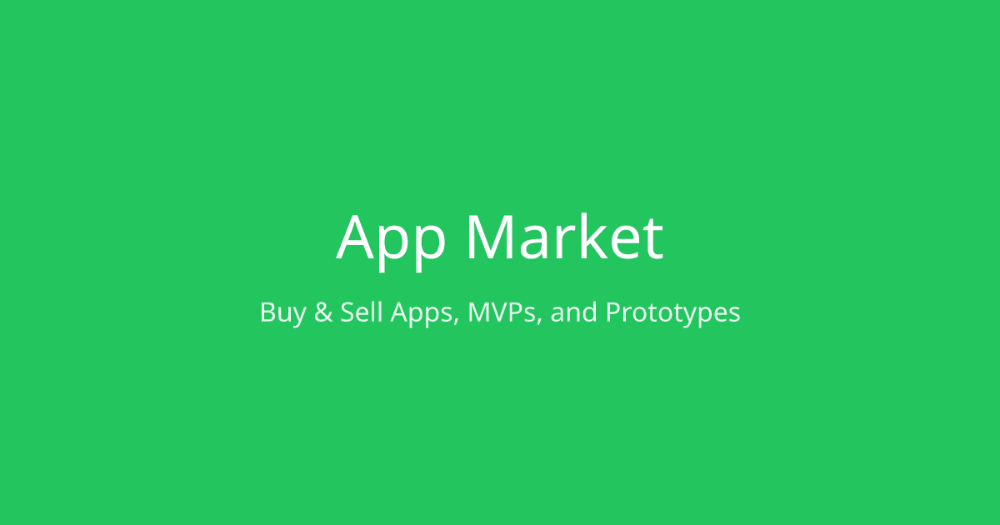

# App Market 🚀

The premier marketplace for buying and selling AI-generated apps, prototypes, and MVPs. Built on Solana for trustless escrow and instant settlement.



## Features

### For Sellers
- **List Projects**: Upload your GitHub repo, add details, set auction parameters
- **Verified Ownership**: Automatic GitHub ownership verification
- **Flexible Pricing**: Auction-style with optional Buy Now price
- **Asset Transfer Tracking**: Checklist-based transfer system
- **Secure Payouts**: Funds released after buyer confirmation

### For Buyers
- **Discover Projects**: Browse by category, filter by tech stack, price range
- **Place Bids**: Real-time bidding with auto-bid option
- **Multiple Payment Options**: SOL, USDC, or credit card
- **Protected Purchases**: Funds held in escrow until transfer complete
- **Dispute Resolution**: Fair resolution process if issues arise

### Platform Features
- **Trustless Escrow**: Solana smart contracts hold funds securely
- **5% Platform Fee**: Competitive marketplace fee
- **2% Dispute Fee**: Charged to losing party in disputes
- **Token Launches**: (Coming Soon) Launch tokens for acquired projects
- **Auto-Buyback**: (Coming Soon) Revenue automatically buys platform token

## Tech Stack

### Frontend
- **Next.js 14** - React framework with App Router
- **TypeScript** - Type safety
- **Tailwind CSS** - Styling
- **Framer Motion** - Animations
- **shadcn/ui** - UI components

### Backend
- **Next.js API Routes** - Backend API
- **Prisma** - Database ORM
- **PostgreSQL** - Database
- **NextAuth.js** - Authentication

### Blockchain
- **Solana** - Blockchain platform
- **Anchor** - Solana development framework
- **Solana Wallet Adapter** - Wallet connectivity

### Payments
- **Stripe** - Credit card payments
- **Solana Pay** - Crypto payments

## Getting Started

### Prerequisites
- Node.js 18+
- PostgreSQL database
- Solana CLI (for smart contract deployment)
- Stripe account (for fiat payments)

### Installation

1. **Clone the repository**
   ```bash
   git clone https://github.com/yourusername/app-market.git
   cd app-market
   ```

2. **Install dependencies**
   ```bash
   npm install
   ```

3. **Set up environment variables**
   ```bash
   cp .env.example .env
   # Edit .env with your values
   ```

4. **Set up the database**
   ```bash
   npx prisma generate
   npx prisma db push
   ```

5. **Run the development server**
   ```bash
   npm run dev
   ```

6. **Open the app**
   Visit [http://localhost:3000](http://localhost:3000)

### Deploying the Solana Program

1. **Build the program**
   ```bash
   cd programs/app-market
   anchor build
   ```

2. **Deploy to devnet**
   ```bash
   anchor deploy --provider.cluster devnet
   ```

3. **Update the program ID**
   Copy the program ID and update:
   - `programs/app-market/src/lib.rs`
   - `lib/solana.ts`

## Project Structure

```
app-market/
├── app/                    # Next.js App Router pages
│   ├── api/               # API routes
│   │   ├── listings/      # Listing endpoints
│   │   ├── bids/          # Bid endpoints
│   │   ├── transactions/  # Transaction endpoints
│   │   ├── disputes/      # Dispute endpoints
│   │   ├── payments/      # Stripe payment endpoints
│   │   └── webhooks/      # Stripe webhooks
│   ├── explore/           # Browse listings
│   ├── listing/[slug]/    # Individual listing page
│   ├── create/            # Create listing flow
│   ├── dashboard/         # User dashboard
│   └── auth/              # Authentication pages
├── components/            # React components
│   ├── layout/           # Layout components
│   ├── listings/         # Listing-related components
│   ├── home/             # Homepage components
│   └── ui/               # UI primitives
├── lib/                  # Utility functions
│   ├── db.ts            # Prisma client
│   ├── auth.ts          # NextAuth config
│   └── solana.ts        # Solana utilities
├── prisma/              # Database schema
│   └── schema.prisma    # Prisma schema
├── programs/            # Solana programs
│   └── app-market/      # Main escrow program
├── public/              # Static assets
└── styles/              # Global styles
```

## Smart Contract Architecture

### Accounts
- **Config**: Platform configuration (fees, admin, treasury)
- **Listing**: Individual auction/listing data
- **Escrow**: Holds buyer funds during transfer
- **Dispute**: Dispute information and evidence

### Instructions
- `initialize`: One-time platform setup
- `create_listing`: Create a new listing
- `place_bid`: Place a bid on a listing
- `buy_now`: Instant purchase at Buy Now price
- `settle_auction`: End auction and determine winner
- `release_escrow`: Release funds to seller
- `refund_escrow`: Refund funds to buyer
- `open_dispute`: Open a dispute
- `resolve_dispute`: Resolve a dispute

## Monetization

| Revenue Stream | Rate | Description |
|---------------|------|-------------|
| Platform Fee | 5% | Deducted from sale price |
| Dispute Fee | 2% | Charged to losing party |
| Token Launch Fee | 1% | Of token supply (coming soon) |
| Featured Listings | TBD | Premium placement (coming soon) |
| Verified Badges | TBD | Trust verification (coming soon) |

## Roadmap

### Phase 1 ✅ (Current)
- [x] Core marketplace functionality
- [x] Solana escrow smart contract
- [x] Auction and Buy Now
- [x] Transfer checklist system
- [x] Dispute resolution (manual)
- [x] Stripe fiat payments

### Phase 2 (Next)
- [ ] Token launch feature
- [ ] Auto-buyback mechanism
- [ ] Featured listings
- [ ] Verified seller badges
- [ ] Advanced search and filters

### Phase 3 (Future)
- [ ] Community arbitration
- [ ] Platform governance token
- [ ] Mobile app
- [ ] API for third-party integrations

## Contributing

We welcome contributions! Please see our [Contributing Guide](CONTRIBUTING.md) for details.

## License

This project is licensed under the MIT License - see the [LICENSE](LICENSE) file for details.

## Support

- **Discord**: [Join our community](https://discord.gg/appmarket)
- **Twitter**: [@appmarket](https://twitter.com/appmarket)
- **Email**: support@app.market

---

Built with ❤️ for the builder community
# Updated Mon Jan 12 11:12:59 AEDT 2026
